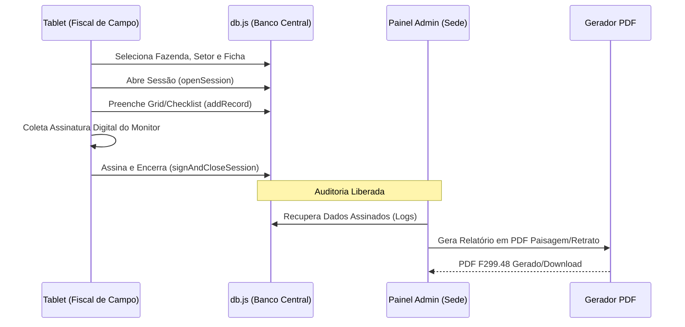

# Estrutura do Projeto para draw.io

Para gerar os diagramas automaticamente no [draw.io](https://app.diagrams.net/):
1. No draw.io, vá em **+ (Mais Figuras)** -> **Avançado** -> **Mermaid** (Para diagramas de fluxo)
2. OU vá em **Arquivo** -> **Importar de...** -> **CSV** (Para estrutura de pastas)

---

## 1. Arquitetura Técnica (Diagrama de Componentes)
*Copie o código abaixo e cole na opção Mermaid do draw.io*

```mermaid
graph TD
    subgraph "Camada de Interface (Tablet & Admin)"
        A[App.jsx - Roteamento] --> B[AuthContext.jsx - Permissões]
        B --> C[Pages/Tablet - Operação]
        B --> D[Pages/Admin - Auditoria]
    end

    subgraph "Camada de lógica (Coração do Sistema)"
        C --> E[db.js - Mock Database]
        D --> E
        E --> F[LocalStorage - Banco de Dados Local]
        E --> G[pdf.js - Motor de Relatórios]
    end

    subgraph "Saída e Compliance"
        G --> H[Relatórios PDF Oficiais (F299, CL02)]
        E --> I[Trilha de Auditoria (Logs de Ações)]
    end

    style F fill:#f9f,stroke:#333,stroke-width:2px
    style H fill:#dfd,stroke:#333,stroke-width:2px
    style I fill:#ffd,stroke:#333,stroke-width:2px
```

---

## 2. Fluxo de Vida de um Formulário (Compliance Flow)
*Copie o código abaixo e cole na opção Mermaid do draw.io*



---

## 3. Estrutura de Pastas (Para importar como CSV)
*Copie este bloco no draw.io via Arquivo -> Importar de... -> CSV*

```csv
# label: %name%
# style: shape=folder;fillColor=#dae8fc;strokeColor=#6c8ebf;
# connect: {"from":"parent", "to":"id", "invert":true}
# node: {"width":120, "height":60}
id,name,parent
1,src,
2,services,1
3,pages,1
4,components,1
5,db.js,2
6,pdf.js,2
7,tablet,3
8,admin,3
9,GridInspection.jsx,7
10,FormSelection.jsx,7
11,SessionDetail.jsx,8
12,Dashboard.jsx,8
```
